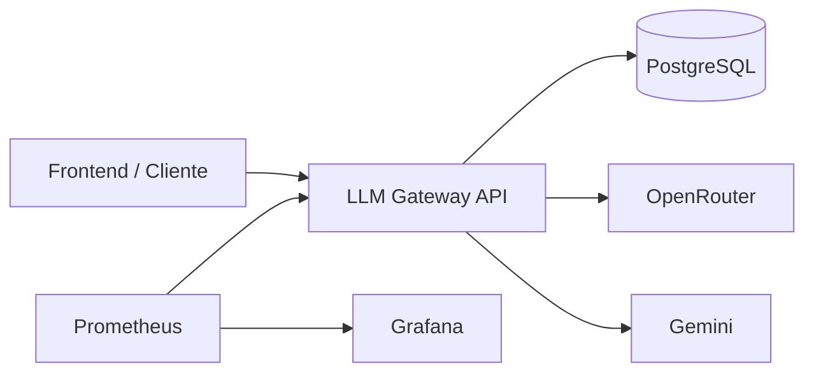
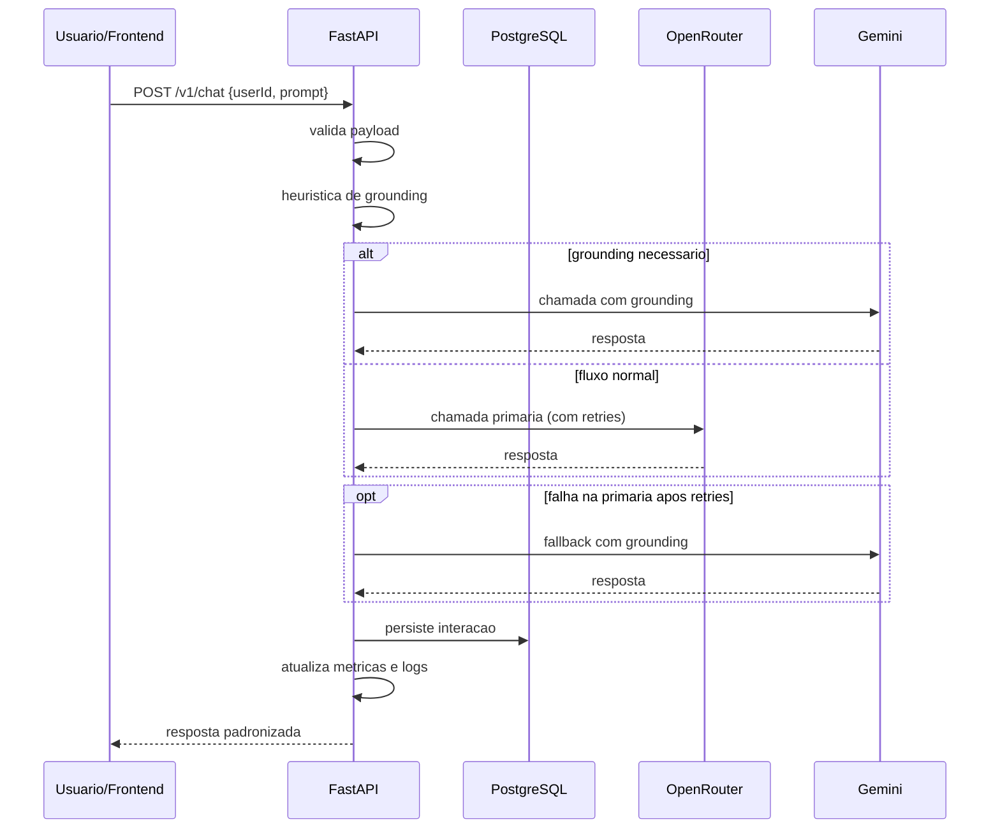
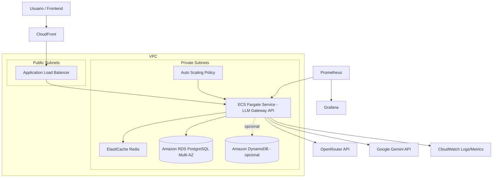

# Architecture Documentation - LLM Gateway API

## 1. System Overview

A LLM Gateway API e um micro-servico FastAPI que centraliza interacoes com LLMs, persistencia de conversas e observabilidade.



### Componentes

Nota: no fluxo de observabilidade, o Prometheus puxa metricas da API (scrape em `/metrics`) e o Grafana consulta o Prometheus.

- FastAPI: endpoint de chat, health e metricas
- LLM Service: roteamento, retries e fallback
- Providers: OpenRouter (primario) e Gemini (grounding/fallback)
- Persistencia: SQLAlchemy + Alembic + PostgreSQL
- Observabilidade: Prometheus + Grafana

## 2. Fluxo Funcional



## 3. O que esta implementado hoje

- Endpoint de chat unico (`/v1/chat`)
- Persistencia de prompts e respostas
- Retry com exponential backoff (tenacity)
- Fallback para provedor secundario
- Grounding por heuristica de prompt
- Endpoint `/metrics` com metricas HTTP e LLM
- Stack local com Docker Compose (API, DB, Redis, Prometheus, Grafana)

## 4. Observabilidade

Metricas principais exportadas:

- `http_requests_total{method, endpoint, status_code}`
- `http_errors_total{method, endpoint, status_code}`
- `http_request_duration_seconds` (histogram)
- `llm_calls_total{provider, model, outcome}`
- `llm_grounding_total{reason}`
- `llm_fallback_total{primary_provider, fallback_provider}`

Queries base usadas no dashboard:

```promql
sum(http_requests_total)
sum(http_errors_total)
sum(http_request_duration_seconds_sum) / sum(http_request_duration_seconds_count)
sum(llm_calls_total) by (provider, model, outcome)
sum(llm_fallback_total)
sum(llm_grounding_total) by (reason)
```

## 5. Resiliencia e limites atuais

### Implementado

- Retries para chamada primaria
- Fallback para Gemini quando necessario
- Tratamento global de excecoes

### Parcial / roadmap

- Circuit breaker: existe esqueleto em `app/core/circuit_breaker.py`, ainda nao integrado no fluxo de execucao
- Fila assincrona para persistencia: previsto como melhoria futura

## 6. Seguranca

- Validacao de entrada com Pydantic
- Segredos por variaveis de ambiente
- CORS configuravel via settings
- Recomendacao de HTTPS em producao

## 7. Deploy local e cloud

### Local (atual)

- Docker Compose com rede unica
- Exposicao de portas para API, Prometheus e Grafana

### Cloud (proposta)

- ECS/EKS + ALB + Auto Scaling
- RDS PostgreSQL Multi-AZ
- CloudWatch para logs/metricas de infra

### Desenho cloud native AWS (proposta)



Leitura do desenho:

- Escalonamento: ALB distribui trafego e Auto Scaling ajusta tasks no ECS/Fargate.
- Observabilidade: metricas de app em Prometheus/Grafana e logs/infra em CloudWatch.
- Dados: PostgreSQL em RDS Multi-AZ para resiliencia e persistencia transacional.
- DynamoDB aparece como alternativa opcional para cenarios de escala extrema com padrao chave-valor.
- Resiliencia de dependencias: retries/fallback no app; roadmap de circuit breaker.
- VPC (Virtual Private Cloud): rede privada isolada na AWS onde ficam ALB, ECS, Redis e RDS com segmentacao por subnets.
- Observacao importante: CloudWatch e Prometheus sao trilhas diferentes; CloudWatch recebe logs/metricas de infra e Prometheus coleta metricas da aplicacao.

### Justificativa da escolha de banco de dados

- Solucao escolhida: PostgreSQL (RDS na proposta cloud)
- Motivo 1: o dominio e transacional (salvar prompt e resposta com integridade)
- Motivo 2: necessidade de consultas futuras para analise/auditoria
- Motivo 3: SQL e schema relacional facilitam evolucao de relatorios
- Motivo 4: RDS reduz custo operacional (backup, patching, HA)

Alternativas:

- DynamoDB: mais simples para chave-valor, mas menos direto para consultas relacionais do caso
- Data lake/Athena: mais indicado para analytics em lote, nao para fluxo transacional online

## 8. Evidencias para entrega

Para a documentacao do desafio, anexar:

1. Print do dashboard Grafana com paineis de HTTP e LLM.
2. Export JSON do dashboard.
3. Print do Prometheus mostrando `llm_calls_total` e target `fastapi-app` em estado UP.
4. Resultado dos comandos de validacao:

```bash
docker compose exec api pytest tests/ -v
docker compose exec api ruff check .
```

Arquivos de evidencia versionados no repositorio:

- Dashboard Grafana exportado: [docs/grafana-dashboard-llm-gateway-observability.json](grafana-dashboard-llm-gateway-observability.json)
- Screenshot do dashboard: [docs/screenshots/grafana_dashboard.png](screenshots/grafana_dashboard.png)
- Screenshot do Prometheus com `llm_calls_total`: [docs/screenshots/llm_calls_total-prometheus.png](screenshots/llm_calls_total-prometheus.png)
- Screenshot do target `fastapi-app` em UP: [docs/screenshots/target_up-prometheus.png](screenshots/target_up-prometheus.png)

---

Architecture Documentation v1.2
Last Updated: April 2, 2026
